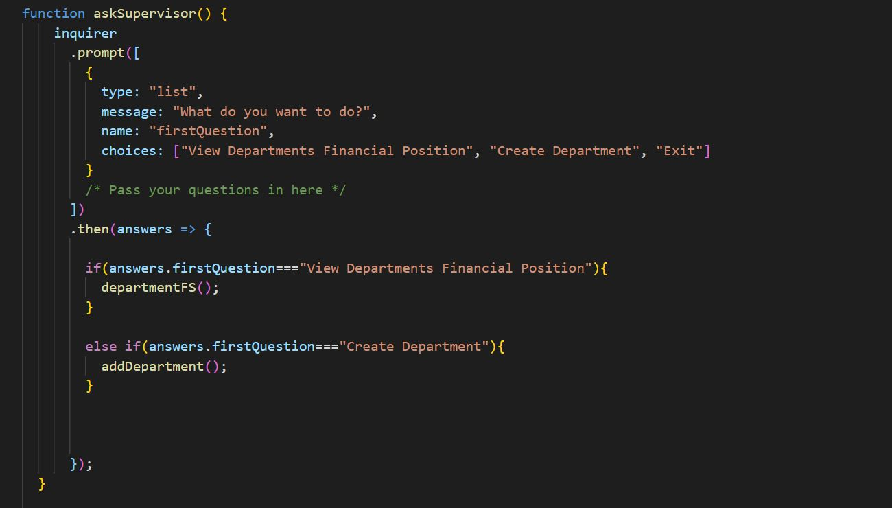
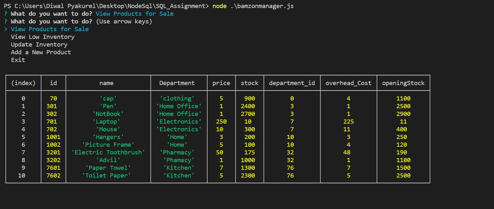

# Bamzon

### The bamzon app is the clone version of Amazon database app. This is a simple version, where a customer can look for the item and give instruction to buy the product. The app also provides room for manager and supervisor. The manager can view the product as customer and can also the lower level of inventory and add inventory. Beside that, manager can add a new product as well. The scope for supervisor is limited to getting data for sales, cost and profit and add a new department. 

###Bamzon Customer

Steps Followed for making this application work.

1. Created a table with product id, department name, product name, price, opening stock and current stock.
2. Used inquirer npm to ask user if he wants to access product info or buy the product or exit. 
3. If the product info is selected then the user will get product details hich includes the product id and a recursive function is applied so that once the user gets product id, he/she can select option to buy the product.
4. Once the buy option is selected, application will further ask the product id, quantity and confrmation.
5. After receiving the order, it will provide the total cost and will update the database.

SQL Syntax and application codes. Note: I have only attached important codes.
 

###Bamzon Manager

Steps Followed for making this application work.

1. For supevisor, same SQL table used for customer is used. 
2. Used Inquirer NPM to ask the manager, what he is looking for.
3. The application will prompt the manager the option to view the product, view low inventory levels, add inventory to current product and create a new product on the app.
4. If selected any of the option, it will capture relevant data from the SQL table.
5. Recrusive function is used so that the user do not have to exit everytime if one option is selected. 

SQL Syntax and application codes. Note: I have only attached important codes.

###Bamzon Supervisor

Steps Followed for making this application work.

1. As for customer and manager, the bamzon supervisor app also uses the inquirer app to ask the supervisor what he is looking for.
2. The supervisor can select the option to see the financial position of every department or create a new department.
3. If the supervisor selects financial position, then the data from Opening Stock, Current Stock, Sales Price, Overhead cost are manipulated and Profit, Sales and Cost column are generated.
4. If the supervisor selects create a new department then it adds a new department. The manager will be asked to provide depatment name and department id.

SQL Syntax and application codes. Note: I have only attached important codes.

### NPM/Technology Used
1. Inquirer NPM
2. MySQL NPM
3. Node JS
4. MY SQL Database

### Comand Line Argument used for the app
1. movie-his : Will look for movie
2. concert-this : Will look for artist concert
3. spotify-this : Will look for the track
4. do-what-it-says : Will capture the data from .txt file and search in Spotify API

###Screenshots of CommandLine

